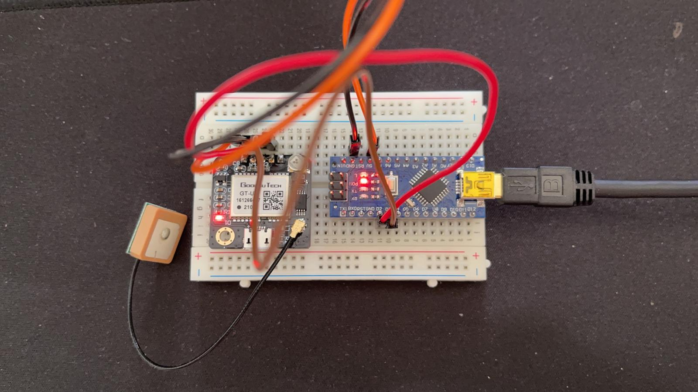
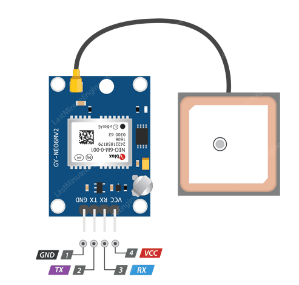

# NEO-6M_GPS

This repository records the development and setup of the NEO-6M GPS Module.

## Author

Govind Ajith Kumar

## OS

- Ubuntu 18.04
- Windows 10

The connections are laid out here:

| Connect From Arduino |  Connect To gps |
| ------------- | ------------- | 
| D3  | Rx  | 
| D2 | Tx | 
| GND | GND  | 
| 5V | Vin | 

The connections are made as follows:

<p align="center">
  
</p>


The pinout is as follows:

<p align="center">
  
</p>

Install the following on your Arduino IDE by going to **Tools > Manage Libraries**

- Arduino BNO055
- Adafruit Unified Sensor
- TinyGPS ++
	- To install this, click [this](https://github.com/mikalhart/TinyGPSPlus/archive/master.zip) and download
	- Unzip
	- Rename to TinyGPSPlus
	- Move it to the location with all the libraries. In my case it is *~/Arduino/libraries*
	- Re-open IDE

Install Pyserial

    pip install pyserial

Verify the USB Port by entering:

    ls /dev/tty

After verifying, 

On **Ubuntu**, make this port an executable by entering:

    sudo chmod a+rw /dev/ttyUSB0 

On **Windows**, start command line as **administrator**, and run the python 
command

## Running Instructions

- To run on an Ubuntu computer, set the serial port to ```/dev/ttyUSB0```
- To run on a Windows computer, set the serial port to ```COM10``` or ```COM11```.

## ARDUINO C CODE LOOKUP TABLE


| Serial Number| Arduino Code Folder  | Function | 
| ------------- | ------------- | ------------- |
| 1  | GPS_READ_TEST | To access the GPS Data and print it in NMEA format | 
| 2  | GPS_LONGITUDE_LATITUDE_TEST | To access the GPS Data and print it in Longitudes and Latitudes | 

## PYTHON CODE LOOKUP TABLE

| Serial Number| Code  | Function | Arduino Code Flashed |
| ------------- | ------------- | ------------- |------------- |
| 1 |  gps_read.py| To access the GPS Data through pyserial, print and save it in a text file |GPS_LONGITUDE_LATITUDE_TEST |
| 2 |  global2xy.py| To convert the GPS Coordinates to Cartesian coordinates ans save into text file | - |

The GPS outpus will be in NMEA Codes. The meanings of the NMEA Codes are as follows:

**$GPGSA** – GPS DOP and active satellites
**$GPGSV** – Detailed GPS satellite information
**$GPGLL** – Geographic Latitude and Longitude
**$GPRMC** – Essential GPS pvt (position, velocity, time) data
**$GPVTG** – Velocity made good